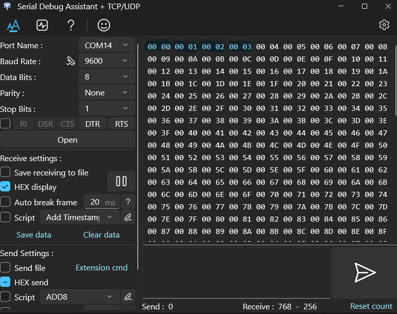

# CMODA7_Demo_UART_TX_Verilog

This is CMOD A7 FPGA UART Transmiter & Receiver Demo project for Digital System Lab. The demo project using UART Transmit (Verilog) 16 bits DATA from FPGA to PC(Receiver). A Python Script has been developed to open the UART and get the Data from CMOD A7;

## Getting Started
### Search all serial port
```python3 uart_search_port.py```
```
COM4: Standard Serial over Bluetooth link (COM4) 
COM13: Standard Serial over Bluetooth link (COM13)
COM14: USB Serial Port (COM14)
Available serial ports:
['COM4', 'COM13', 'COM14']
```
### Program the FPGA via Vivado
### Modify UART Port in 'uart_fpga_rx.py'
\# Replace 'COM14' with your serial port name:

`serial_port = 'COM14' #Replace 'COM14' with your serial port name`

### Run UART Receiver
```python3 uart_fpga_rx.py```
* The demo python program is used to receive 10000 8-bits data and calculate the frequency of data occurrences; (Question: How to combain 2 8-bits data into one 16 bits data);

### Serial Debug Assistant (Optional)
You can also receive uart via "Serial Debug Assistant". Please download the APP in Microsoft Store.
#### 16bits Receive via Serial Debug Assistant

As is shown above, the FPGA transmit 16 bits data to PC with Serial Debug Assistant. The first 16 bits data is "00 00" and second is "00 01";

### UART TX Module Usage
* Inputs:
1. clk: System clock signal for synchronizing the transmission process (Baud Rate).
2. ap_rstn: Asynchronous, active low reset signal to initialize or reset the module's internal states.
3. ap_ready: Input signal indicating readiness to start data transmission. When high, transmission begins.
4. pairty: Input signal to enable (when high) or disable (when low) parity bit generation and transmission.
5. data: 8-bit data input to be transmitted over UART.

* Outputs:
1. ap_vaild: Output signal that indicates the completion of a data transmission cycle.
2. tx: Serial output transmitting the encoded data along with start, stop, and optional parity bits.

## Prerequisites

* Vivado 2023.1;
* CMOD A7-35T Board File;
* Python >= 3.5;
* pyserial;
``` pip3 install pyserial```

<!-- ## MCP3202 Simulation Result -->

## Reference
Pyserial :
https://pyserial.readthedocs.io/en/latest/pyserial.html

## License
This project is licensed under the MIT License